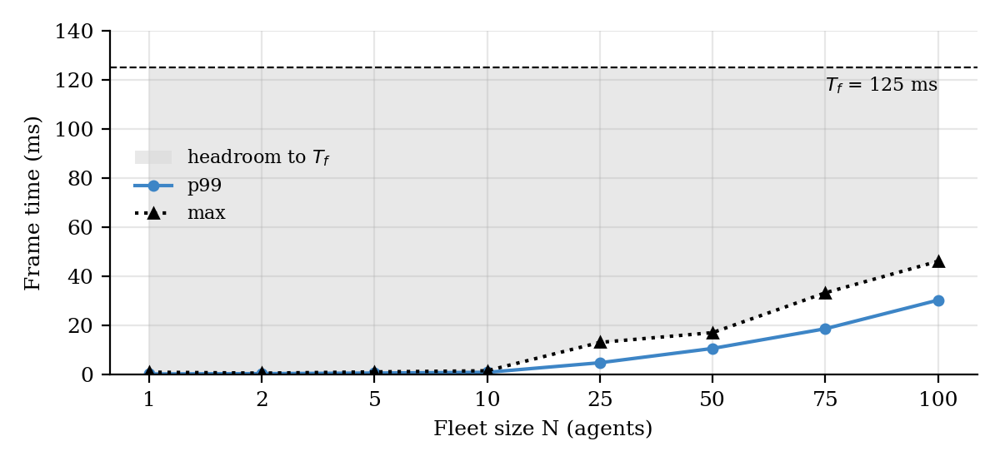
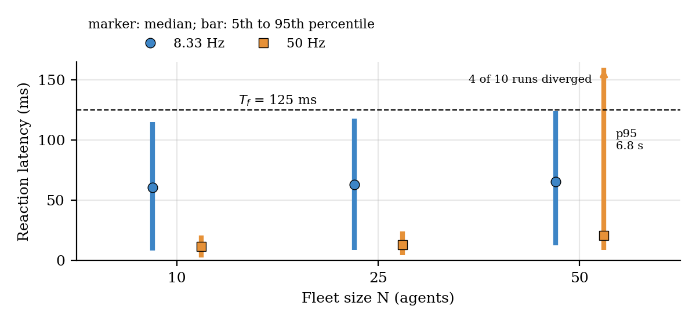
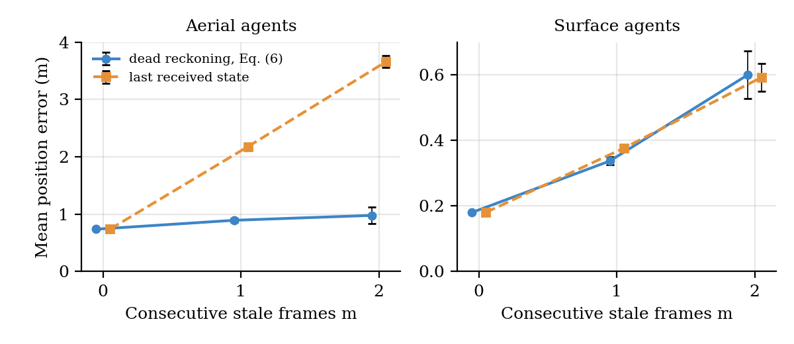

# Mission-DT

**Mission-level Digital Twin for hybrid fleets of physical and virtual
unmanned vehicles** (aerial and surface), built on MQTT with a Python core,
a 3D mission view, and a live agent panel.

This repository is the companion code of the paper *"A Mission-Level Digital
Twin for Hybrid Fleets of Physical and Virtual Unmanned Vehicles"* (SBESC
2026). It holds the implementation, the experiment scripts, the raw data of
every run, and the scripts that compute the values of the tables and figures
of the paper.

## Contents
1. [Model](#model)
2. [Scope of the evaluation](#scope-of-the-evaluation)
3. [Requirements](#requirements)
4. [Quick start](#quick-start)
5. [Mission configuration](#mission-configuration)
6. [3D view and live monitoring](#3d-view-and-live-monitoring)
7. [Reproducing the experiments](#reproducing-the-experiments)
8. [Measurements](#measurements)
9. [Results](#results)
10. [Tests](#tests)
11. [Repository layout](#repository-layout)
12. [Connecting real vehicles](#connecting-real-vehicles)
13. [Citation](#citation)
14. [License](#license)

## Model
| Element | Definition | Code |
|---|---|---|
| Mission state | `M^t = <B^t, φ^t, g^t>`: agent states, Mission Context, and agent goals. The mission, and not a single vehicle, is the twinned entity. | `mission_dt/model.py` |
| Mission transition `Δ^e` | Runs once per frame of `T_f = 125 ms` and composes `δ^e` (state update, with dead reckoning when an agent sends no new telemetry), `Φ` (context), `σ` (goals), and `λ` (actuation), in this order. | `mission_dt/model.py` |
| Agents | Each agent is a physical vehicle (ArduPilot with a MAVLink-to-MQTT adapter) or a virtual agent (vehicle-level emulator with its own kinematic model, state, and MQTT connection). The core applies the same `Δ^e` to both kinds. A mission with virtual agents only is a digital model. | `mission_dt/agents.py` |
| Mission Context `φ^t` | For each agent k, the horizontal distance `φ_k^t` to the nearest agent `j_k^t` of the same domain. When `φ_k^t` falls below `d_sep`, `λ` sends a corrective command (separation rule). | `mission_dt/model.py` |
| Bandwidth regulator | Each agent steps its model at 50 Hz and publishes one of every six cycles (8.33 Hz, 6.0x less uplink traffic). | `mission_dt/agents.py` |
| MQTT I/O | The core keeps, per agent, the pending telemetry message with the highest sequence number, runs `Δ^e`, and publishes the actuation of each agent. | `mission_dt/core.py` |

The symbols follow Table II and Eqs. (1) to (6) of the paper.

## Scope of the evaluation
The paper evaluates the Python runtime with virtual agents only, on one
virtual CPU, with five runs per configuration and independent packet loss.
The separation rule is the only collective behavior, and each agent follows
one waypoint fixed at mission start. The evaluation leaves out physical
vehicles with the MAVLink-to-MQTT adapter and the broker bridge, timing
guarantees, wireless links with bursty loss, and a comparison with AirSim.

## Requirements
| Component | Version of the paper runs |
|---|---|
| Python | 3.11.15 for E1 to E5, 3.12.3 for E6 (rclpy of ROS 2 Jazzy needs Python 3.12). Python 3.10 or later runs the core. |
| Mosquitto | 2.0.18, started with `mosquitto -c mosquitto.conf` (`set_tcp_nodelay true`) |
| Python packages | `pip install -r requirements.txt` (paho-mqtt 2.1.0, matplotlib) |
| 3D view (machine with GPU and display) | `pip install ursina imageio imageio-ffmpeg` |
| Terminal panel with colors (optional) | `pip install rich` |
| E6 only | ROS 2 Jazzy (rclpy 7.1.12, `rmw_fastrtps_cpp` 8.4.4, Fast DDS 2.14.6) and Gazebo Harmonic (gz-sim 8.15.0, gz-physics 7.8.0 with DART, gz-transport 13.6.0) |

## Quick start
The launcher checks the virtual environment, starts the broker when no broker
runs, clears leftover retained MQTT state, and opens the mission and the 3D
view:
```bash
./run_mission.sh                              # default mission
./run_mission.sh configs/mission_photo.json   # another mission file
```
**ESC** in the 3D view stops all processes.

The same steps in separate terminals (with the terminal panel):
```bash
mosquitto -c mosquitto.conf                    # terminal 1 (broker)
python experiments/demo_mission.py             # terminal 2 (mission)
python viz/mission_viz.py                      # terminal 3 (3D view)
python experiments/panel.py                    # terminal 4 (panel)
```

## Mission configuration
`configs/mission_default.json` sets the fleet size and the routes:
```json
{ "profile": "orbitas",
  "drones": { "aerial": 5, "surface": 5 },
  "radius_m": 45.0, "arrive_m": 3.0, "aerial_alt_m": 15.0,
  "checkpoints": {}, "assignments": {} }
```
| Setting | Meaning |
|---|---|
| `profile: orbitas` | Antipodal patrol |
| `profile: paralelo` | Parallel lanes |
| `profile: explorador` | Aerial agents scout a moving point ahead of their paired surface agent |
| `profile: aleatorio` | Random waypoints that converge on a common destination, regenerated every lap |
| `checkpoints` | Labeled points (P01, ...) as `[lat, lon, alt_m]`: alt > 0 air corridor, 0 surface, < 0 submerged |
| `assignments` | Checkpoint sequence per agent; agents can share checkpoints |

`configs/mission_checkpoints_example.json` is a small example with explicit
routes, and `configs/mission_photo.json` (6 agents, 10 checkpoints) is the
mission of Fig. 4 of the paper. The core publishes checkpoints and planned
routes as retained MQTT messages, so the 3D view labels them without a
configuration file.

`experiments/staged_photo.py` places every agent at a fixed pose (goal equal
to the current position), so the safety-sphere states (white, orange, red)
appear from the first frame; one agent keeps patrolling to show the route
lines. The coordinate constants at the top of the file set the scene.
```bash
python experiments/staged_photo.py     # terminal 1
python viz/mission_viz.py              # terminal 2
```

## 3D view and live monitoring
| Button / key | Action |
|---|---|
| FOTO / `P` | Screenshot into `captures/` |
| REC / `R` | Record MP4 (H.264) into `captures/` |
| HQ / `H` | Toggle 30 fps and 15 fps |
| ID / `I` | Agent name labels |
| ROTA / `K` | Planned-route lines (green; gray dots show the past trail) |
| LEG / `L` | Legend |
| PANEL / `O` | Agent panel inside the 3D window (reuses `panel.py`) |
| `G` / `ESC` | Sky grid / quit |

| Cue | Meaning |
|---|---|
| Gray agent | No telemetry for 1.5 s |
| Pulsing red marker | Battery below 17.6 V |
| White sphere (12 m radius) | Neighbor closer than 24 m |
| Orange sphere | Neighbor closer than 12 m (conflict) |
| Red sphere | Neighbor closer than 3 m |

`experiments/panel.py` is an independent MQTT client that prints one row per
agent (position, altitude, speed, battery, telemetry rate, status) twice per
second, on any machine that reaches the broker.

`experiments/clear_retained.py` clears leftover retained MQTT state (agent
registrations, checkpoints, routes); `run_mission.sh` and `run_all.sh` call it.

## Reproducing the experiments
```bash
REPS=5 bash run_all.sh       # E1 to E5, five runs into results/rep1/ to results/rep5/ (paper setting)
bash run_all.sh              # one run into results/
```
`run_all.sh` checks the virtual environment, starts Mosquitto with
`mosquitto.conf` when no broker runs, clears retained state, pins the broker
and the experiments to core 0 with `taskset`, runs E1 to E5, and writes the
diagnostic figures of `make_figures.py`. With `REPS` above 1,
`experiments/aggregate.py` writes `results/summary.json` and
`results/summary.md`. One run takes about 15 min. A broker that already runs
keeps its own configuration.

| Experiment | RQ | Command | Output file |
|---|---|---|---|
| E1 scalability, N = 1 to 100, regulator on | RQ1 | `python experiments/run_experiments.py all` | `e1_scalability.json` |
| E2 regulator on and off, N = 10 | RQ2 | (same command as E1) | `e2_regulator.json` |
| E3 swarm-reaction latency, N = 10, 25, 50, 8.33 Hz | RQ3 | `python experiments/run_e3.py` | `e3_swarm.json` |
| E3 without the regulator (50 Hz) | RQ3 | `python experiments/run_e3.py --no-regulator [N ...]` | `e3_swarm_noreg.json` |
| E4 twin fidelity at 0, 5, and 10% loss, N = 10 | RQ4 | `python experiments/run_e4.py` | `e4_fidelity.json` |
| E4 without the regulator | RQ4 | `python experiments/run_e4.py --no-regulator` | `e4_fidelity_noreg.json` |
| E5 CPU and peak memory of the core process, N = 0, 10, 50, 100 | RQ5 | `python experiments/run_e5.py` | `e5_resources.json` |
| E6 Mission-DT vs. ROS 2 vs. Gazebo, N = 10, 50, 100 (outside `run_all.sh`) | RQ5 | `taskset -c 0 python3.12 experiments/run_e6.py` | `e6_comparison.json` |
| Summary over runs | | `python experiments/aggregate.py results/rep1 ... results/rep5` | `summary.json`, `summary.md` |
| Values and PNGs of Figs. 3, 5, 6 | | `python experiments/paper_figures.py` | `doc/figures/` |

Every script reads and writes the directory in `MDT_RESULTS` (default
`results/`), e.g. `MDT_RESULTS=results/rep1 python experiments/run_e3.py`.

### E6 stacks
`experiments/run_e6.py` runs the same fleet (goals on the E5 grid) on three
stacks, one after the other, with every process pinned to core 0 (child
processes inherit the affinity). The script reads `MDT_ROS_SETUP` (default
`/opt/ros/jazzy/setup.bash`) and starts its own broker, so port 1883 must be
free.

| Stack | Processes | Implementation |
|---|---|---|
| `mission_dt` | core, agents, broker | The two processes of E5 (`MissionDT` of `core.py`, N `VirtualAgent` threads) and a Mosquitto broker started for the trial with `mosquitto.conf`. |
| `ros2` | mission node, agents | rclpy node that subscribes `/mdt/<id>/telemetry`, publishes `/mdt/<id>/actuation` (`std_msgs/String` with the JSON payloads of the MQTT stack), and calls `Delta_e` of `model.py` in a 125 ms timer of a `SingleThreadedExecutor`. The agents process runs N `VirtualAgent` threads (same state, kinematics, 50 Hz step, and 8.33 Hz telemetry) with a ROS 2 publisher and subscription in place of the MQTT client. QoS best effort, keep last 1, volatile; default RMW; `ROS_DOMAIN_ID=42`, discovery range localhost. The mission node knows the fleet from the start (no registration topic). |
| `gazebo` | gz sim server | `gz sim -s -r --headless-rendering` with a generated SDF world: N box vehicles on the goal grid, `VelocityControl` with a constant twist (2 m/s surface, 12 m/s aerial), and `OdometryPublisher` at 8.33 Hz; Physics system only, no gravity, 1 ms step, target real-time factor 1. No mission layer. A monitor process subscribes to `/world/e6/stats` and to every odometry topic; the table reports its CPU and memory as `monitor`, outside the stack total. |

### Platform of the paper runs
| Item | Value |
|---|---|
| Host | Linux VM, kernel 6.18, Intel Xeon 2.10 GHz, 2 vCPU |
| CPU pinning | Broker and experiments on core 0 (`taskset -c 0`) |
| Broker | Mosquitto 2.0.18 with `mosquitto.conf` (`set_tcp_nodelay true`) |
| Client sockets | `TCP_NODELAY` on the core and agent MQTT sockets |
| Runs | Five per configuration (`results/rep1/` to `results/rep5/`); five more at N = 50 for E3 at 50 Hz |

## Measurements
| Quantity | Definition |
|---|---|
| Frame time (`frame_ms`) | Time from the start of the frame (collection of the inputs I^t) to the return of the `publish` call of the last actuation. The `on_frame` and 3D-view hooks run after the measurement. A frame overrun is a frame time above 125 ms. |
| Release jitter (`release_jitter_ms`) | Actual start of a frame minus its scheduled start. The schedule advances 125 ms per frame and restarts from the current time after an overrun. |
| Swarm-reaction latency (E3) | `t_apply(neighbor) - t_pub(triggering telemetry)`: time from the publication of the telemetry that triggers a corrective command to the application of that command by the neighbor agent. |
| Twin fidelity (E4) | Position and heading error of the twin state against the ground truth that the virtual agents log at 50 Hz, interpolated at the frame instant. Each agent drops each telemetry message with probability `p_loss`. |
| Core CPU (`core_cpu_pct`, E1 to E3) | User + system CPU time of the frame-loop thread (`time.thread_time`) plus the paho-mqtt network thread (`/proc/self/task/<tid>/stat`, Linux only) over the run, in % of one core. The virtual agents run as threads of the same process and are not counted. `core_cpu_s` (E1, E2) gives the two threads apart. |
| Process CPU (`cpu_pct`, E5) | User + system CPU time of the whole Mission-DT process over wall time, in % of one core. The agents run in a second process; N = 0 is the core connected with no agent. |
| Peak memory (`peak_rss_mib`, E5) | Peak resident set of the Mission-DT process (`VmHWM` on Linux, `ru_maxrss` elsewhere). |
| Stack CPU and memory (`processes.*`, `total`, E6) | Per process: user + system CPU time from `/proc/<pid>/stat` over a 30 s window that starts 5 s after the agents start (Gazebo: 5 s after the monitor receives the odometry of every vehicle), in % of one core; `VmHWM` and `VmRSS` from `/proc/<pid>/status` at the end of the window. `total` sums the processes of the stack. |
| Real-time factor (`gazebo.rtf`, E6) | Simulated time over wall time of the Gazebo server across the window, from the first and last `/world/e6/stats` messages of the window. |
| Statistics over runs | x ± y is the mean ± sample standard deviation of the per-run values. *Pooled* values use all raw samples of the five runs, with the percentile rule `sorted[min(n-1, floor(p*n/100))]`. |

## Results
All values come from `results/rep1/` to `results/rep5/` (and
`results/e3_noreg_n50_extra/` for E3 at 50 Hz and N = 50).
`results/summary.md` holds every aggregated metric, and
`doc/figures/paper_figures.json` holds the plotted values of Figs. 3, 5, and 6.

### Summary by research question
| RQ | Result |
|---|---|
| RQ1 | 0 frame overruns in 9,600 frames up to N = 100; at N = 100 the pooled 99th percentile of the frame time is 30.4 ms and the maximum 46.2 ms, 78.8 ms below `T_f`. |
| RQ2 | The regulator cuts uplink traffic by 5.99 ± 0.00x and redundant samples by 131.92 ± 5.06x (N = 10). |
| RQ3 | At 8.33 Hz, the median swarm-reaction latency is 61 to 65 ms (about half a frame) for N = 10 to 50, with a maximum of 287.6 ms. At 50 Hz, the median falls to 12, 13, and 21 ms, and at N = 50 the MQTT queues grew in 4 of 10 runs. |
| RQ4 | Position RMSE of 0.62 to 0.63 m up to 10% loss, maximum drift 3.34 m; 0.18 to 0.20 m without the regulator. |
| RQ5 | At N = 100 the core process uses 12.1% of one core and 24.8 MiB (E5); the Mission-DT stack uses 35.4% and 110.1 MiB against 51.8% and 207.8 MiB for ROS 2 (32% less CPU, 47% less memory) (E6). |

### E1 Scalability (RQ1, Fig. 3)


*p99 and maximum frame time over the 1,200 frames (five runs of 240) of each
fleet size. The gray area is the headroom between the maximum and `T_f`.*

| N | Overruns / frames | Frame mean (ms) | Frame p99 (ms) | Frame p99 pooled (ms) | Frame max pooled (ms) | Telemetry p99 pooled (ms) | Uplink (KiB/s) | Core CPU (%) |
|---|---|---|---|---|---|---|---|---|
| 1 | 0/1200 | 0.214 ± 0.015 | 0.36 ± 0.06 | 0.34 | 1.08 | 0.76 | 4.6 | 0.4 ± 0.0 |
| 2 | 0/1200 | 0.279 ± 0.013 | 0.50 ± 0.06 | 0.49 | 0.69 | 1.02 | 9.3 | 0.6 ± 0.0 |
| 5 | 0/1200 | 0.381 ± 0.023 | 0.74 ± 0.10 | 0.72 | 1.20 | 1.57 | 23.2 | 0.9 ± 0.0 |
| 10 | 0/1200 | 0.534 ± 0.016 | 0.99 ± 0.11 | 1.02 | 1.66 | 2.27 | 46.4 | 1.4 ± 0.0 |
| 25 | 0/1200 | 1.146 ± 0.070 | 4.36 ± 1.32 | 4.93 | 13.20 | 3.86 | 115.9 | 3.1 ± 0.2 |
| 50 | 0/1200 | 3.610 ± 0.266 | 10.36 ± 1.43 | 10.75 | 17.17 | 7.57 | 231.8 | 5.5 ± 0.1 |
| 75 | 0/1200 | 7.217 ± 0.714 | 18.56 ± 0.99 | 18.76 | 33.39 | 13.79 | 347.5 | 8.8 ± 0.4 |
| 100 | 0/1200 | 11.196 ± 1.202 | 29.98 ± 3.93 | 30.40 | 46.22 | 22.78 | 463.1 | 11.8 ± 0.5 |

### E2 Bandwidth regulator (RQ2)
| Regulator | Uplink (KiB/s) | Messages/s | Redundant samples | Telemetry p99 pooled (ms) | Frame p99 pooled (ms) |
|---|---|---|---|---|---|
| On (8.33 Hz) | 46.4 ± 0.0 | 83.6 ± 0.0 | 95 ± 4 | 2.04 | 0.92 |
| Off (50 Hz) | 277.6 ± 0.1 | 500.2 ± 0.1 | 12545 ± 3 | 1.72 | 1.07 |
| Ratio off/on | 5.99 ± 0.00 | | 131.92 ± 5.06 | | |

### E3 Swarm-reaction latency (RQ3, Fig. 5)


*Median (marker) and 5th to 95th percentile (bar) of five pooled 40 s runs per
fleet size, ten at 50 Hz and N = 50.*

| Rate | N | Runs | Commands | Median (ms) | p5 (ms) | p95 (ms) | Max (ms) | ≤ 125 ms (%) |
|---|---|---|---|---|---|---|---|---|
| 8.33 Hz | 10 | 5 | 4,686 | 60.7 | 8.3 | 114.9 | 121.9 | 100.0 |
| 8.33 Hz | 25 | 5 | 20,694 | 63.1 | 9.0 | 117.8 | 134.2 | 99.7 |
| 8.33 Hz | 50 | 5 | 67,350 | 65.4 | 12.5 | 124.1 | 287.6 | 95.6 |
| 50 Hz | 10 | 5 | 5,296 | 11.7 | 2.8 | 20.8 | 27.5 | 100.0 |
| 50 Hz | 25 | 5 | 21,164 | 13.3 | 4.5 | 24.4 | 51.0 | 100.0 |
| 50 Hz | 50 | 10 | 126,610 | 20.9 | 8.9 | 6,831.8 | 31,712.2 | 89.7 |

At 8.33 Hz, the latency is spread between 0 and one frame because the age of
the newest telemetry at the frame instant is uniformly distributed between 0
and the 120 ms publication period. At 50 Hz and N = 50, the 2,500 messages
per second saturate the shared core, and in 4 of the 10 runs the MQTT queues
grew until latencies reached 1.1 s to 31.7 s.

### E4 Twin fidelity under packet loss (RQ4, Table III, Fig. 6)
| Loss (%) | Stale frames (%) | Pos. RMSE (m) | Pos. p99 (m) | Max drift (m) | Hdg. RMSE (°) | Pos. RMSE without regulator (m) |
|---|---|---|---|---|---|---|
| 0 | 0.0 | 0.617 ± 0.001 | 1.49 | n/a | 0.6 | 0.182 ± 0.003 |
| 5 | 4.7 | 0.624 ± 0.004 | 1.50 | 2.34 | 0.7 | 0.185 ± 0.002 |
| 10 | 9.4 | 0.632 ± 0.011 | 1.51 | 3.34 | 0.9 | 0.195 ± 0.006 |



*Mean position error with dead reckoning (Eq. 6) and with the last received
state versus the number m of consecutive stale frames in the 15 runs of E4.
Error bars: 95% confidence interval.*

| Domain | m | Agent-frames | Dead reckoning (m) | Last received state (m) |
|---|---|---|---|---|
| Aerial | 0 | 17,107 | 0.738 ± 0.006 | 0.738 ± 0.006 |
| Aerial | 1 | 780 | 0.893 ± 0.032 | 2.177 ± 0.034 |
| Aerial | 2 | 64 | 0.979 ± 0.146 | 3.657 ± 0.104 |
| Surface | 0 | 17,136 | 0.180 ± 0.001 | 0.180 ± 0.001 |
| Surface | 1 | 770 | 0.337 ± 0.012 | 0.376 ± 0.009 |
| Surface | 2 | 57 | 0.600 ± 0.074 | 0.593 ± 0.042 |

The runs recorded 12 agent-frames with m ≥ 3 (at most five consecutive stale
frames); `doc/figures/paper_figures.json` lists them.

### E5 Resources of the core process (RQ5)
| N | CPU (% of one core) | Peak memory (MiB) | Overruns |
|---|---|---|---|
| 0 | 0.1 ± 0.0 | 22.6 ± 0.1 | 0 |
| 10 | 1.5 ± 0.1 | 23.1 ± 0.1 | 0 |
| 50 | 5.8 ± 0.2 | 23.8 ± 0.1 | 0 |
| 100 | 12.1 ± 0.2 | 24.8 ± 0.0 | 0 |

### E6 Mission-DT vs. ROS 2 vs. Gazebo (RQ5, Table IV)
| Stack, process | CPU % (N = 10) | MiB (N = 10) | CPU % (N = 50) | MiB (N = 50) | CPU % (N = 100) | MiB (N = 100) |
|---|---|---|---|---|---|---|
| Mission-DT, total | 4.4 ± 0.4 | 62.0 | 18.8 ± 0.6 | 83.3 | 35.4 ± 2.9 | 110.1 |
| Mission-DT, core | 1.4 ± 0.1 | 25.4 | 5.9 ± 0.2 | 26.3 | 11.8 ± 1.1 | 27.4 |
| Mission-DT, agents | 2.6 ± 0.3 | 29.2 | 11.6 ± 0.4 | 49.6 | 21.1 ± 1.6 | 75.1 |
| Mission-DT, broker | 0.3 ± 0.0 | 7.4 | 1.3 ± 0.1 | 7.4 | 2.4 ± 0.2 | 7.6 |
| ROS 2, total | 7.8 ± 0.5 | 143.8 | 32.7 ± 3.7 | 172.4 | 51.8 ± 2.7 | 207.8 |
| ROS 2, mission node | 4.3 ± 0.4 | 69.6 | 19.3 ± 3.8 | 75.3 | 28.7 ± 2.1 | 82.4 |
| ROS 2, agents | 3.5 ± 0.2 | 74.2 | 13.4 ± 0.3 | 97.1 | 23.0 ± 0.8 | 125.3 |
| Gazebo server | 47.4 ± 0.8 | 146.6 | 97.2 ± 0.1 | 263.3 | 97.2 ± 0.1 | 409.7 |
| Gazebo real-time factor | 0.999 ± 0.000 | | 0.744 ± 0.014 | | 0.329 ± 0.006 | |

Both mission stacks completed all frames within `T_f`. Gazebo saturates the
core from N = 50, so its CPU value is a lower bound. E1 to E5 ran Python 3.11
and E6 Python 3.12, so the core values of E5 and E6 differ.

### Original code (submitted version) on the same host
`results/linux_original_code/` holds five runs of the code of the submitted
paper (branch `main`) on the host above, with the default Mosquitto
configuration (Nagle's algorithm enabled). Nagle's algorithm delays small MQTT
messages by about 40 ms on Linux.

| Metric (pooled) | Submitted paper | Original code, this host | Revised code |
|---|---|---|---|
| Median telemetry latency, N = 100 (ms) | 38.5 | 38.2 | 1.6 |
| E3 median, N = 10 / 25 / 50 (ms) | 118 | 119.1 / 118.4 / 118.2 | 60.7 / 63.1 / 65.4 |
| E4 position RMSE, 0 to 10% loss (m) | 0.88 to 0.92 | 0.89 to 0.91 | 0.62 to 0.63 |

### Other result directories
| Directory | Content |
|---|---|
| `results/other_instance/` | Two runs on a second VM instance of the same type; the p99 frame time at N = 100 reached 54.3 ms, without overruns. The second run stops after E3. |
| `results/single_run/` | One earlier run of E1 to E4 before the instrumentation hooks moved out of the timed frame interval. |
| `results/rerun_client_nagle/` | One run before `TCP_NODELAY` on the client sockets (actuation p99 near 43 ms). |
| `results/windows_original_code/` | One run of E1 to E4 of the original code on Windows (Intel i7-9700) with its figures; `platform-b/` holds E1 and E2 of a second machine. |

`results/README.md` describes the JSON fields of each file.

## Tests
```bash
python -m pytest tests
```
| Test | Check |
|---|---|
| `tests/test_equivalence.py` | Replays the same telemetry through the original core (`core_orig.py`) and through `Δ^e` of `model.py` and compares states and commands frame by frame (missing, duplicate, and reordered messages; separation; agents without telemetry). |
| `tests/test_model.py` | Desk check of `Δ^e` on the scenario of Section II of the paper (3 agents, 5 frames): reordered messages, dead reckoning, an agent with no state, and an exact tie in the nearest neighbor. |

## Repository layout
| Path | Content |
|---|---|
| `mission_dt/` | `model.py` (`Δ^e` and its functions), `core.py` (MQTT I/O and frame loop), `agents.py` (virtual agents), `core_orig.py` (core of the submitted version) |
| `experiments/` | `run_experiments.py` (E1, E2), `run_e3.py`, `run_e4.py`, `run_e5.py`, `run_e6.py`, `aggregate.py`, `paper_figures.py`, `make_figures.py`, `demo_mission.py`, `staged_photo.py`, `panel.py`, `clear_retained.py` |
| `viz/` | 3D mission view (Ursina) |
| `configs/` | Mission configuration files |
| `results/` | Raw data of every run (JSON), `summary.json` and `summary.md`, logs; see `results/README.md` |
| `doc/figures/` | PNGs and values of Figs. 3, 5, and 6 |
| `doc/MissionDT_Manual_v02.pdf` | User manual of the submitted version |
| `tests/` | Equivalence test and desk check |
| `mosquitto.conf` | Broker configuration of the paper runs |
| `run_mission.sh` | Launcher (broker, mission, 3D view) |
| `run_all.sh` | Experiment battery (E1 to E5 and diagnostic figures) |
| `check_uptodate.sh` | Maintainer script: checks a checkout for the markers of each feature |
| `requirements.txt` | Python dependencies |

## Connecting real vehicles
A MAVLink-to-MQTT adapter on the companion computer of each vehicle (e.g.
Raspberry Pi 4 with ArduPilot) publishes telemetry on
`missiondt/agents/<id>/telemetry` and consumes `missiondt/agents/<id>/actuation`.
A local broker on the vehicle bridges to the ground station over Wi-Fi
(Section III and Fig. 2 of the paper). The repository does not include the
adapter yet.

## Citation
```bibtex
@inproceedings{missiondt2026,
  title     = {A Mission-Level Digital Twin for Hybrid Fleets of Physical and Virtual Unmanned Vehicles},
  author    = {M{\'o}r, Filipo and Silva, C{\'a}ssio and Domingues, Anderson and Webber, Thais and Marcon, C{\'e}sar},
  booktitle = {Brazilian Symposium on Computing Systems Engineering (SBESC)},
  year      = {2026}
}
```

## License
MIT (see `LICENSE`).
